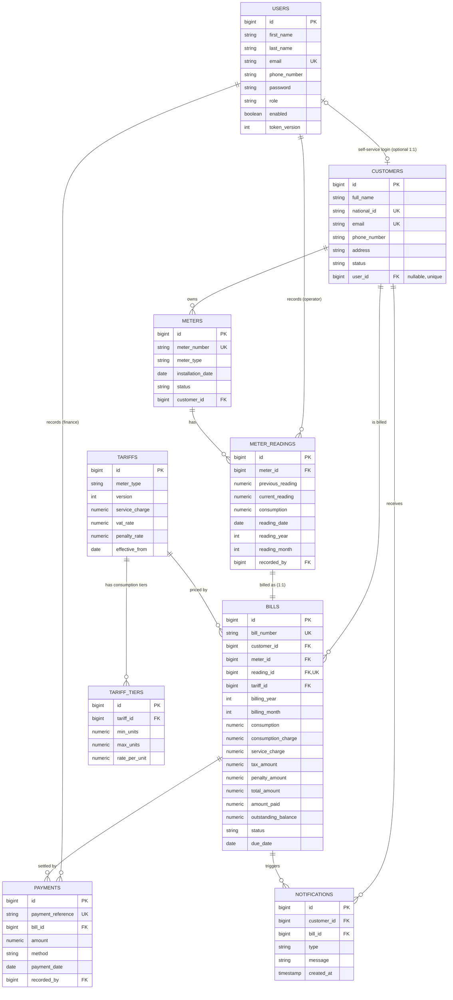
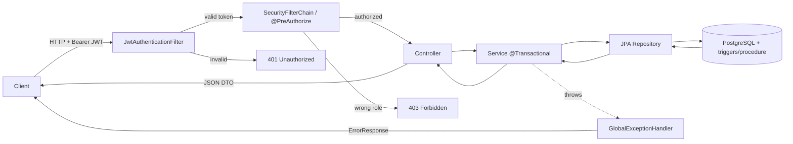
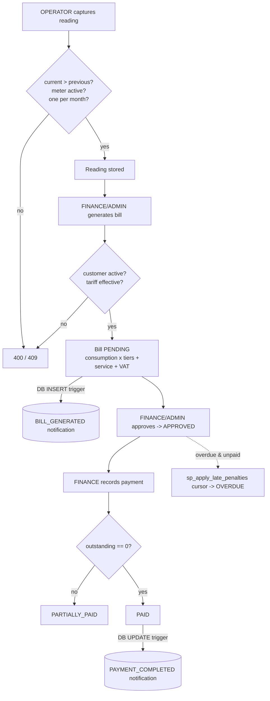

# Utility Billing System (WASAC / REG)

A secure, automated backend for a national utility company that manages customers,
meters, meter readings, postpaid billing, payments, and customer notifications —
built with **Spring Boot 4**, **Spring Data JPA**, **Spring Security (JWT)**,
**Flyway**, **PostgreSQL**, and documented with **Swagger UI**.

This document covers the design artefacts (ERD + flow diagram) and how to run and
exercise the API. It maps directly onto the six exam tasks.

---

## 1. Tech stack

| Concern            | Choice                                             |
|--------------------|----------------------------------------------------|
| Language / runtime | Java 17, Spring Boot 4.0.x                          |
| Persistence        | Spring Data JPA / Hibernate                         |
| Database           | PostgreSQL (runtime), H2 PostgreSQL-mode (tests)   |
| Migrations         | Flyway (`src/main/resources/db/migration`)         |
| Security           | Spring Security, stateless JWT (access + refresh)  |
| DB routines        | PL/pgSQL triggers + a cursor-based stored procedure |
| API docs           | springdoc OpenAPI / Swagger UI                      |

The schema is owned by Flyway; Hibernate runs in `validate` mode (it never
generates DDL), so the entity model and the migrations are kept in lock-step.

---

## 2. Roles (Task 1)

| Role            | Responsibilities                                              |
|-----------------|--------------------------------------------------------------|
| `ROLE_ADMIN`    | Configure tariffs, approve bills, manage users, manage data  |
| `ROLE_OPERATOR` | Register customers/meters, capture meter readings            |
| `ROLE_FINANCE`  | Approve bills, record payments, apply penalties              |
| `ROLE_CUSTOMER` | View own bills, payment history, and notifications           |

Self-signup (`POST /api/auth/register`) creates a `CUSTOMER`. Staff accounts
(`OPERATOR`, `FINANCE`, additional `ADMIN`s) are created by an admin via
`POST /api/admin/users`. A seed admin is created on first start
(`admin@java-exam.local` / `admin12345`, configurable via `app.admin.*`).

All endpoints require a valid JWT **except** `/api/auth/**` and the Swagger docs.
Fine-grained access is enforced with `@PreAuthorize` per handler.

---

## 3. Entity Relationship Diagram (ERD)



Constraints worth noting:

- `customers.national_id` and `customers.email` are unique → prevents duplicate
  customer registration (Task 2).
- `meter_readings (meter_id, reading_year, reading_month)` is unique → one reading
  per meter per month/year (Task 3).
- `tariffs (meter_type, version)` is unique → tariffs are versioned (Task 4).
- `bills.reading_id` is unique → at most one bill per reading (Task 5).

---

## 4. Spring Boot flow diagram

### 4.1 Request pipeline



### 4.2 Billing lifecycle (Tasks 3 → 6)



---

## 5. Database routines and messaging (Task 6)

Because PL/pgSQL is PostgreSQL-specific, the routines live in a vendor-scoped
Flyway location (`db/specific/{vendor}`), separate from the portable schema in
`db/migration`. At runtime `{vendor}` resolves to `postgresql`; under the H2
context-load test it resolves to `h2`, which gets a no-op placeholder.

Defined in `db/specific/postgresql/V5__billing_routines.sql`:

1. **Trigger `trg_bill_after_insert`** → on every new bill, inserts a
   `BILL_GENERATED` notification using the required message format:

   ```
   Dear <CustomerName>,
   Your <Month/Year> utility bill of <Amount> FRW has been successfully processed.
   ```

2. **Trigger `trg_bill_after_update`** → when a bill transitions to `PAID`,
   inserts a `PAYMENT_COMPLETED` notification for the customer.

3. **Stored procedure `sp_apply_late_penalties()`** → uses an explicit **cursor**
   to walk overdue, unpaid bills and add the tariff's penalty. Invoked from
   `POST /api/bills/apply-penalties`.

---

## 6. Running it

### Prerequisites
- JDK 17+, PostgreSQL running locally with a database `java_exam`.

```bash
createdb java_exam            # or use your DBMS tooling
./mvnw spring-boot:run        # Windows: mvnw.cmd spring-boot:run
```

Override defaults with env vars (`DB_URL`, `DB_USERNAME`, `DB_PASSWORD`,
`JWT_SECRET`, `MAIL_*`, `ADMIN_*`). Flyway applies all migrations on startup.

- Swagger UI: <http://localhost:8080/swagger-ui.html>
- OpenAPI JSON: <http://localhost:8080/v3/api-docs>

Run the tests (uses in-memory H2, no PostgreSQL/SMTP needed):

```bash
./mvnw test
```

---

## 7. End-to-end walkthrough (Postman/Swagger)

1. **Login as admin** — `POST /api/auth/login` with the seed admin; copy the
   `accessToken` and click **Authorize** in Swagger.
2. **Configure a tariff** — `POST /api/tariffs` (ADMIN), e.g. WATER with a flat
   tier `{minUnits:0, maxUnits:null, ratePerUnit:323}`, `serviceCharge:2000`,
   `vatRate:18`, `penaltyRate:5`, `effectiveFrom:<this month>`.
3. **Register a customer** — `POST /api/customers` (ADMIN/OPERATOR).
4. **Register a meter** — `POST /api/meters` for that customer.
5. **Capture a reading** — `POST /api/readings` (OPERATOR).
6. **Generate the bill** — `POST /api/bills/generate?readingId=...` (FINANCE/ADMIN).
   → a `BILL_GENERATED` notification appears (`GET /api/notifications`).
7. **Approve the bill** — `POST /api/bills/{id}/approve`.
8. **Record payments** — `POST /api/payments` (partial, then the remainder).
   On full payment the bill becomes `PAID` and a `PAYMENT_COMPLETED`
   notification is generated by the DB trigger.
9. **Customer view** — register/login a `CUSTOMER` account with the **same email**
   as the customer record (the two are auto-linked via `customers.user_id` when
   either is created), then call `GET /api/me/bills`, `/api/me/payments`,
   `/api/me/notifications`. An account with no linked profile gets a clear 404.

---

## 8. API surface (summary)

| Area              | Endpoints                                                                 | Roles            |
|-------------------|--------------------------------------------------------------------------|------------------|
| Auth              | `POST /api/auth/{register,login,refresh,logout,...}`                      | public           |
| Admin users       | `POST/GET /api/admin/users`, `PATCH /api/admin/users/{id}/{role,status}`  | ADMIN            |
| Customers         | `POST/PUT/GET /api/customers`, `PATCH /api/customers/{id}/status`         | ADMIN/OPERATOR(/FINANCE read) |
| Meters            | `POST/GET /api/meters`, `PATCH /api/meters/{id}/status`                   | ADMIN/OPERATOR(/FINANCE read) |
| Readings          | `POST/GET /api/readings`                                                  | OPERATOR/ADMIN(/FINANCE read) |
| Tariffs           | `POST/GET /api/tariffs`                                                   | ADMIN(/FINANCE read) |
| Bills             | `POST /api/bills/generate`, `/{id}/approve`, `/apply-penalties`, `GET`    | FINANCE/ADMIN    |
| Payments          | `POST/GET /api/payments`                                                  | FINANCE/ADMIN    |
| Notifications     | `GET /api/notifications`                                                  | ADMIN/FINANCE    |
| Customer portal   | `GET /api/me/{bills,payments,notifications}`                              | CUSTOMER         |

---

## 9. Date validation

Every date the API accepts is validated so it can only ever hold a value that
makes sense for the system. Two layers enforce this:

**Field-level** — a reusable `@PlausibleDate` bean-validation constraint rejects
nonsense values (a `400` with a clear message) before a request reaches the
service:

| Field | Rule |
|-------|------|
| `installationDate` (meter) | a real date, on/after the system epoch (2000-01-01), not in the future |
| `readingDate` (reading)    | a real date, on/after the epoch, not in the future |
| `paymentDate` (payment)    | a real date, on/after the epoch, not in the future |
| `effectiveFrom` (tariff)   | a real date, on/after the epoch, at most 5 years ahead |

**Cross-record** — rules that depend on other data are enforced in the services:

- a **reading** cannot pre-date the meter's `installationDate`;
- a **payment** cannot pre-date the day its bill was issued;
- a new **tariff** version's `effectiveFrom` must be *after* the current
  version's, so versions always move forward in time.

## 10. Scope notes

- **Postpaid billing** is implemented end-to-end for both water and electricity,
  reflecting the company's goal of unifying everything onto a postpaid model.
  Prepaid token-vending is intentionally out of scope (no explicit task requires
  it) and would be a future extension.
- Late penalties are applied on demand via the cursor-based stored procedure
  rather than a background scheduler, keeping the moving parts minimal.
