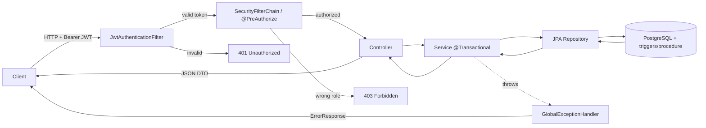
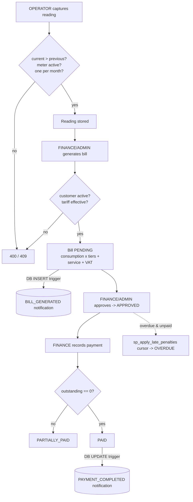

# Architecture

The application follows a conventional layered Spring Boot design. Each HTTP request
flows through a JWT security filter, a controller, a transactional service, and a JPA
repository before reaching PostgreSQL, where triggers and a stored procedure handle
the database-side automation.

## Layers

| Layer | Responsibility |
|-------|----------------|
| **Controller**  | Maps HTTP requests to actions, validates payloads, returns DTOs |
| **Service**     | Business logic, transactions (`@Transactional`), cross-record rules |
| **Repository**  | Spring Data JPA data access |
| **Model**       | JPA entities, enums, and shared response shapes |
| **Security**    | Stateless JWT filter, `SecurityFilterChain`, `@PreAuthorize` checks |
| **Database**    | Schema + PL/pgSQL triggers and the late-penalty stored procedure |

## Request pipeline

Every request carries a Bearer JWT (except `/api/auth/**` and the Swagger docs). The
filter authenticates it, the security layer authorizes the role, and any error is
funnelled through a single global handler that returns a consistent error shape.

## Billing lifecycle

The core domain flow runs from a captured reading through to a settled, fully-paid
bill. Validation happens at each step, and two of the transitions are automated by
database triggers (see [Database routines](database-routines.md)).

For a hands-on run through this flow, see the [walkthrough](walkthrough.md).
