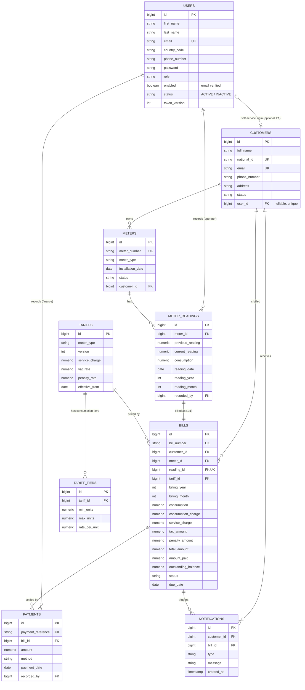

# Data model

The schema is owned by Flyway (`src/main/resources/db/migration`) and validated by
Hibernate at startup. The diagram below shows the core entities and how they relate;
the complete schema — including the auth-token table, enums, and audit timestamps — is
maintained as a machine-readable DBML file in [`erd.dbml`](erd.dbml) (paste it into
<https://dbdiagram.io> to render).

## Entity-relationship diagram

## Constraints that enforce the rules

The business rules are backed by database constraints, so they hold regardless of how
data is inserted:

| Constraint | Effect |
|------------|--------|
| `customers.national_id` unique, `customers.email` unique | Prevents duplicate customer registration |
| `meter_readings (meter_id, reading_year, reading_month)` unique | One reading per meter per month/year |
| `tariffs (meter_type, version)` unique | Tariffs are versioned per meter type |
| `bills.reading_id` unique | At most one bill per reading |
| `customers.user_id` nullable + unique | Optional 1:1 link to a self-service login |

## Customer ↔ user link

A `CUSTOMER` record (the billed party) is distinct from a `USER` (a login). They are
optionally linked 1:1 via `customers.user_id`: when a customer self-registers — or
when an admin creates a customer whose email matches an existing user — the two are
auto-linked. That link is what powers the customer portal (`/api/me/**`). An account
with no linked customer profile gets a clear `404`.
